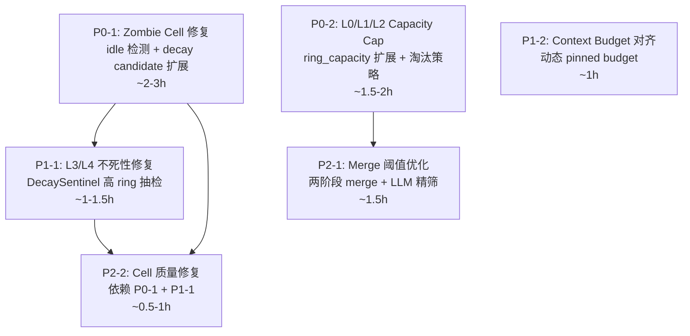

# Tree Harness 系统健康风险分析与修复路线图

> 生成时间: 2026-06-26
> 状态: 分析完成,待修复
> 范围: 长期运行 (50+ episodes) 场景下的结构性风险

## 1. 概述

通过对 Tree Harness 全部核心模块的代码审计,发现 **8 个结构性问题**,
其中 2 个为致命级 (P0),3 个为高危级 (P1),3 个为中危级 (P2)。

核心病根可归纳为三句话:

1. **只有"出生"没有"死亡"** — Zombie Cell 无法被清理
2. **只有"上升"没有"下降"** — L3/L4 一旦升上去就下不来
3. **只有"累积"没有"淘汰"** — L0 无上限膨胀

预期影响: ~50 episodes 后系统开始退化,~100 episodes 后 context 被僵尸污染、
有用 cell 升不上去、L3/L4 被老 cell 锁死。

---

## 2. 问题清单

### P0-1: Zombie Cell — 未被引用的 cell 永远无法被清理

**严重度: P0-CRITICAL (系统致命)**

#### 问题描述

未被引用的 L0 cell 的 energy 从 0.5 开始乘性衰减,趋近 0 但**永远不变负**。
DecaySentinel 只检查 `energy < -0.20` 的 cell,因此这些 cell 永远不会被验证、
永远不会被隔离,变成永久僵尸。

#### 根因 (代码级)

| 文件 | 位置 | 代码 | 问题 |
|------|------|------|------|
| `energy_system.py` | L39 | `energy_threshold: float = -0.20` | 阈值为负,但乘性衰减不会产生负值 |
| `energy_system.py` | L101-108 | `new_energy = cell.energy * (1.0 - rate)` | 乘性衰减,E→0 但不变负 |
| `energy_system.py` | L134-143 | `get_decay_candidates()` | 只查 `energy < threshold`,无 idle 检测 |
| `sqlite_backend.py` | L239-254 | `query_decay_candidates()` | SQL 只按 energy 过滤,无时间维度 |
| `energy_system.py` | L40-42 | `idle_thresholds` 已定义 | L0=2, L1=8, ... 但**从未被使用** |

#### 数学证明

```
L0 cell, 初始 E=0.5, decay_rate=0.15, 从未被 reference:
  E(1)  = 0.5 * 0.85       = 0.4250
  E(10) = 0.5 * 0.85^10   = 0.0985
  E(20) = 0.5 * 0.85^20   = 0.0194
  E(50) = 0.5 * 0.85^50   = 0.0001
  E(∞)  → 0 (永远 > 0, 永远不 < -0.20)
```

#### 后果

- L0 cell 永久堆积,~100 ep 后可达 200+ 个僵尸 cell
- 向量检索结果被低质量 cell 污染
- 每次维护周期遍历所有 active cell,性能线性退化

#### 修复方案

**方案: 双通道 decay candidate 检测 (energy + idle)**

在 `EnergySystem.get_decay_candidates()` 中增加 idle 检测通道:

```python
def get_decay_candidates(self, limit: Optional[int] = None) -> List[str]:
    # 通道 1: 原有 energy 通道 (保留,用于 challenge 产生的负能量 cell)
    energy_candidates = self.tree_store.sqlite.query_decay_candidates(
        self.config.energy_threshold, limit=limit
    )
    energy_ids = {c.id for c in energy_candidates}

    # 通道 2: idle 通道 — 检查 "最近 N 个 episode 无 reference"
    idle_ids = set()
    for cell in self.tree_store.sqlite.list_active():
        idle_threshold = self.config.idle_thresholds.get(cell.ring, 999)
        # 从 oplog 查最近 reference 的 episode
        last_ref_ep = self._last_reference_episode(cell.id)
        if last_ref_ep is not None:
            episodes_since_ref = self._current_episode - last_ref_ep
            if episodes_since_ref >= idle_threshold:
                idle_ids.add(cell.id)
        elif cell.source != "user_directive":
            # 从未被引用的非用户指令 cell, 且年龄超过 idle_threshold
            age = self._cell_age(cell.id)  # 需要 Lignification 提供 age
            if age >= idle_threshold:
                idle_ids.add(cell.id)

    all_ids = energy_ids | idle_ids
    if limit is not None:
        all_ids = set(list(all_ids)[:limit])
    return list(all_ids)
```

**需要的辅助方法:**
- `OpLog.last_reference_episode(cell_id) -> Optional[int]` — 查最近一次 reference 的 episode seq
- `EnergySystem._current_episode` — 需要注入或共享 episode 计数

**修改文件:**
- `src/tree_harness/modules/energy_system.py` — get_decay_candidates 扩展
- `src/tree_harness/core/oplog.py` — 新增 last_reference_episode()
- `src/tree_harness/modules/outer_harness.py` — 将 episode 计数注入 EnergySystem

**预估工作量:** 2-3 小时

---

### P0-2: L0/L1/L2 无 Capacity Cap — 无限膨胀

**严重度: P0-CRITICAL (系统致命)**

#### 问题描述

`ring_capacity` 只定义了 L3 (60) 和 L4 (20),L0/L1/L2 没有 cap。
每个 episode 蒸馏 1-2 个新 cell,L0 会无限增长。

#### 根因

| 文件 | 位置 | 代码 | 问题 |
|------|------|------|------|
| `lignification.py` | L35 | `ring_capacity: dict = {"L3": 60, "L4": 20}` | 缺少 L0/L1/L2 |
| `lignification.py` | L162-194 | `_enforce_capacity()` | 只检查在 capacity 字典中的 ring |

#### 后果

```
100 episodes * 1.5 cells/ep ≈ 150 个 L0 cell
  → 相似度检索 top_k=20 返回大量低质量 cell
  → max_cells=10 截断, 大部分 cell 永远不被注入
  → 这些 cell 能量衰减到 0, 但仍占用存储
  → decay_all() 每次遍历所有 active cell, O(n) 线性退化
```

#### 修复方案

**方案: 为 L0/L1/L2 加 cap + 淘汰策略**

```python
# lignification.py LignificationConfig
ring_capacity: dict = field(default_factory=lambda: {
    "L0": 50, "L1": 30, "L2": 20,
    "L3": 60, "L4": 20,
})

# 新增淘汰策略配置
eviction_policy: str = "energy_lowest"  # energy 最低的先淘汰
# 替代选项: "maturity_lowest", "oldest_created"
```

在 `_enforce_capacity` 中扩展对 L0/L1/L2 的处理:
- L0/L1/L2 溢出时: 淘汰 energy 最低的 cell (status → archived)
- L3/L4 溢出时: 降级最老的 cell (现有逻辑)

**修改文件:**
- `src/tree_harness/modules/lignification.py` — ring_capacity 扩展 + _enforce_capacity 扩展
- `src/tree_harness/store/tree_store.py` — 新增 archive_cell() 方法
- `src/tree_harness/core/oplog.py` — 新增 ARCHIVE op (或复用 QUARANTINE)

**预估工作量:** 1.5-2 小时

---

### P1-1: L3/L4 不死性 — 升上去就下不来

**严重度: P1-HIGH**

#### 问题描述

一旦 cell 升到 L3/L4,decay_rate 极低 (0.01/0.002),maturity 持续增长
(tanh(E)≈1 时 delta≈0.05/ep),永远不会触发 demote。
DecaySentinel 也不检查正能量的 cell,形成正反馈锁死。

#### 根因

| 文件 | 位置 | 代码 | 问题 |
|------|------|------|------|
| `energy_system.py` | L119-124 | `delta = α*tanh(E) - β*decay_rate` | L3/L4 的 β*rate 极小,maturity 单调增长 |
| `cell_model.py` | L40-45 | `DEMOTE_THRESHOLDS` | L3 demote 需 maturity < 0.55, 但 maturity 只增不减 |
| `decay_sentinel.py` | L90-119 | `funnel_verify()` | 只处理 `get_decay_candidates()` 返回的 cell (energy < -0.20) |

#### 数学分析

```
L3 cell, E=5.0 (多次 reference 后), decay_rate=0.01:
  decay:  E = 5.0 * 0.99 = 4.95
  delta:  0.05 * tanh(4.95) - 0.02 * 0.01 = 0.0500 - 0.0002 = 0.0498
  → maturity 每 ep +0.05, 向 1.0 飙升
  → demote 需 maturity < 0.55, 永远不触发
  → DecaySentinel 不检查 (energy > 0)
  → 结果: L3/L4 cell 永生
```

#### 后果

- 早期升入 L3/L4 的 cell 永久占据 pinned 预算
- 后期更好的 cell 无法进入 pinned 池
- 知识陈旧但无法被替换 (decision/rationale 不可变)

#### 修复方案

**方案: DecaySentinel 增加高 ring 定期抽检**

```python
# decay_sentinel.py 新增方法
def sample_high_ring_cells(self, sample_size: int = 5) -> List[str]:
    """随机抽取 L3/L4 active cell 进行验证 (不依赖 energy threshold)。"""
    high_ring_cells = self.tree_store.sqlite.list_by_ring(
        ["L3", "L4"], status="active"
    )
    import random
    return [c.id for c in random.sample(
        high_ring_cells, min(sample_size, len(high_ring_cells))
    )]
```

在 `OuterHarness.after_step()` 中调用:
```python
# 除了原有的 energy-based 抽样, 增加高 ring 抽检
if self.decay_sentinel is not None:
    # 通道 1: 低能量 cell (原有)
    candidates = self.energy_system.get_decay_candidates(limit=...)
    # 通道 2: 高 ring 定期抽检 (新增)
    if episode_step % N == 0:  # 每 N 个 step 抽检一次
        candidates += self.decay_sentinel.sample_high_ring_cells(sample_size=5)
    verdicts = self.decay_sentinel.funnel_verify(candidates, episode_id=ep_id)
```

**修改文件:**
- `src/tree_harness/modules/decay_sentinel.py` — 新增 sample_high_ring_cells()
- `src/tree_harness/modules/outer_harness.py` — after_step 增加高 ring 抽检调用

**预估工作量:** 1-1.5 小时

---

### P1-2: Idle 检测已定义但未实现

**严重度: P1-HIGH**

#### 问题描述

`EnergyConfig.idle_thresholds` 已定义 (L0=2, L1=8, ...),
但代码注释说"由 DecaySentinel 在 Phase 3 补充",
而 DecaySentinel 代码中**完全没有使用** idle_thresholds。

#### 根因

| 文件 | 位置 | 说明 |
|------|------|------|
| `energy_system.py` | L40-42 | idle_thresholds 定义了但从未被引用 |
| `sqlite_backend.py` | L239-254 | query_decay_candidates 无 idle 参数 |
| `decay_sentinel.py` | 全文 | 无 idle 检测逻辑 |

#### 修复方案

此问题与 P0-1 的修复方案合并 — idle 检测在 `get_decay_candidates()` 中实现,
DecaySentinel 自然会通过 funnel_verify 处理 idle cell。

**额外需要:**
- `OpLog` 新增 `last_reference_episode(cell_id) -> Optional[int]` 方法
- `EnergySystem` 需要知道当前 episode 编号 (从 LignificationScheduler 共享或注入)

**预估工作量:** 包含在 P0-1 中

---

### P1-3: Context Budget 与 Ring Capacity 矛盾

**严重度: P1-HIGH**

#### 问题描述

```python
# ring_capacity: L3=60, L4=20 → 最多 80 个 pinned cell
# context budget: pinned = 4000 * 0.30 = 1200 tokens
# 实际: 1200 tokens / ~100 tokens per cell ≈ 12 个 cell 能被注入
# → 80 个 L3/L4 cell 中 68 个永远看不到
```

#### 根因

| 文件 | 位置 | 代码 | 问题 |
|------|------|------|------|
| `outer_harness.py` | L119-121 | `total_context_tokens: int = 4000` | 总 budget 太小 |
| `outer_harness.py` | L120-122 | `pinned_ratio: 0.30` | 固定比例,不随实际 cell 数调整 |
| `context_injector.py` | L65-91 | `format_pinned()` | 按 energy 降序贪心,老 cell 永远占位 |

#### 修复方案

**方案: 动态 pinned budget 分配**

```python
def _compute_pinned_budget(self) -> int:
    total = self.config.total_context_tokens
    n_pinned_cells = self.tree_store.sqlite.count_cells(
        ring="L3", status="active"
    ) + self.tree_store.sqlite.count_cells(
        ring="L4", status="active"
    )
    # 每个 cell 约 100 tokens, 留 20% 余量
    needed = int(n_pinned_cells * 120 * 1.2)
    # 不超过总 budget 的 50%
    capped = min(needed, int(total * 0.50))
    return max(capped, int(total * 0.10))  # 最低 10%
```

**修改文件:**
- `src/tree_harness/modules/outer_harness.py` — before_step 动态计算 pinned budget

**预估工作量:** 1 小时

---

### P2-1: Merge 阈值过高 — 近重复 cell 堆积

**严重度: P2-MEDIUM**

#### 问题描述

`merge_similarity_threshold = 0.92` 对 BGE embedding 来说非常高。
同一个概念用不同措辞表达,相似度通常在 0.80-0.88,无法合并。

#### 根因

| 文件 | 位置 | 代码 |
|------|------|------|
| `lignification.py` | L39 | `merge_similarity_threshold: float = 0.92` |
| `lignification.py` | L354-400 | `_find_merge_candidates()` 用 cosine_sim >= threshold |

#### 后果

- 近重复 cell 在 L0 堆积,各自竞争有限的 reference
- 每个都拿不到足够的 reference,都无法 promote
- 形成 "碎片化" — 知识分散在多个低质量 cell 中

#### 修复方案

**方案: 两阶段 merge (embedding 粗筛 + LLM 精筛)**

```python
# 阶段 1: embedding 粗筛 (降低阈值)
coarse_threshold: float = 0.82  # 新增配置

# 阶段 2: LLM 判断是否真正语义相同
def _llm_confirm_merge(self, cells: List[Cell]) -> bool:
    """LLM 确认这组 cell 是否表达同一概念。"""
    # ... LLM prompt ...
    # 返回 True/False
```

**修改文件:**
- `src/tree_harness/modules/lignification.py` — 新增 coarse_threshold + LLM 确认
- `src/tree_harness/tests/test_lignification.py` — 更新 merge 测试

**预估工作量:** 1.5 小时

---

### P2-2: Cell 质量不可修复 — 低质量 cell 永久存在

**严重度: P2-MEDIUM**

#### 问题描述

`decision` 和 `rationale` 创建后不可修改 (公理六)。
如果 LLM 产出了有问题的 decision:
- 无法直接修改
- DecaySentinel 不检查正能量的 cell
- Merge 阈值太高,无法被合并覆盖

#### 根因

| 文件 | 位置 | 代码 |
|------|------|------|
| `cell_model.py` | L72 | `_IMMUTABLE_FIELDS = frozenset({"id", "decision", "rationale"})` |
| `cell_model.py` | L107-113 | `__setattr__` 拦截修改 |

#### 修复方案

此问题在 P0-1 (idle 检测) 和 P1-1 (高 ring 抽检) 修复后自然缓解:
- 低质量 L0 cell 会被 idle 检测清理
- 低质量 L3/L4 cell 会被定期抽检隔离
- 隔离后可通过 SUPERSEDE 机制被新 cell 替代

**额外增强 (可选):**
- 新增 `tree_store.supersede_cell(old_id, new_cell)` 的便捷方法
- 在 crystallize 时,如果新 cell 与已有 cell 相似度 > 0.70 但 dedup 判定 INSERT_NEW,
  可以记录关联,供后续 merge 参考

**预估工作量:** 0.5-1 小时 (依赖 P0-1 和 P1-1 完成)

---

### P2-3: LLM 单点依赖 — 4 个关键决策全靠 LLM

**严重度: P2-MEDIUM**

#### 问题描述

| 环节 | LLM 职责 | 失败模式 |
|------|---------|---------|
| Crystallize | 提取 decision/rationale | 太泛→无法匹配；太具体→无法复用 |
| Dedup | REINFORCE vs INSERT_NEW | 判断不一致→重复 cell 堆积 |
| Merge | 生成合并内容 | 质量差→信息丢失 |
| DecaySentinel Step 3 | valid/decayed 裁决 | 误判→错误隔离或错误保留 |

#### 修复方案

此问题是架构级的,短期不需修复。长期建议:
- 增加 LLM 调用的质量指标 (confidence score)
- 对低 confidence 的结果引入二次确认机制
- 在 metrics 中追踪 LLM 产出质量 (如: 被 reference 的 cell vs 被 quarantine 的 cell 比率)

**预估工作量:** 长期改进,不阻塞当前修复

---

## 3. 升层速度数学分析

### 假设: cell 每个 episode 都被 reference (最佳情况)

```
reference: E += 0.10
decay:     E *= (1 - decay_rate)
稳态:      E* = 0.10 / decay_rate (解 E = (E + 0.10) * (1 - rate) 得到)

maturity delta (稳态):
  delta = alpha * tanh(E* / e_norm) - beta * decay_rate
        = 0.05 * tanh(0.10 / rate) - 0.02 * rate
```

| 升层路径 | decay_rate | 稳态 E* | 稳态 delta/ep | 需 maturity 增量 | 纯数学 ep | min_age | **实际最少 ep** |
|---------|-----------|--------|-------------|----------------|---------|---------|------------|
| L0→L1 | 0.15 | 0.667 | 0.026 | 0.15 | 6 | 3 | **6** |
| L1→L2 | 0.10 | 1.000 | 0.036 | 0.25 | 7 | 10 | **10** |
| L2→L3 | 0.03 | 3.333 | 0.049 | 0.25 | 6 | 30 | **30** |
| L3→L4 | 0.01 | 10.00 | 0.050 | 0.20 | 4 | 100 | **100** |

**总路径: L0→L4 最少 ~100 episodes (瓶颈是 min_maturity_age, 不是数学增长速度)**

### 现实约束

- 不是每个 episode 都 pass (不 pass → 无 reference)
- 不是每个 pass 都注入该 cell (budget 限制 + 竞争)
- 一旦几个 ep 没被注入 → energy 衰减 → 下次更难被选 → 滑入僵尸轨道
- 实际预期: 大部分 cell 永远到不了 L2

---

## 4. 修复路线图



### 执行顺序

| 优先级 | 编号 | 标题 | 预估工时 | 依赖 |
|-------|------|------|---------|------|
| **P0** | P0-1 | Zombie Cell — idle 检测 + decay candidate 扩展 | 2-3h | 无 |
| **P0** | P0-2 | L0/L1/L2 Capacity Cap + 淘汰策略 | 1.5-2h | 无 |
| **P1** | P1-1 | L3/L4 不死性 — DecaySentinel 高 ring 抽检 | 1-1.5h | P0-1 (共享 episode 计数) |
| **P1** | P1-2 | Context Budget 与 Ring Capacity 对齐 | 1h | 无 |
| **P2** | P2-1 | Merge 阈值优化 — 两阶段 merge | 1.5h | P0-2 (capacity 限制后碎片更严重) |
| **P2** | P2-2 | Cell 质量修复 | 0.5-1h | P0-1 + P1-1 |

**总预估: ~9-11 小时**

---

## 5. 验证方案

每个修复完成后需要验证:

### 单元测试
- 每个修改的模块对应测试文件更新
- 新增方法需要新增测试用例

### 集成测试
- `run_5ep_verify.py` 扩展为 `run_long_verify.py` (50+ episodes)
- 监控指标:
  - L0 cell 数量是否稳定 (不无限膨胀)
  - Zombie cell 是否被清理 (energy≈0 且 idle 的 cell 被 quarantine)
  - L3/L4 cell 是否有被 quarantine 的记录
  - Pinned budget 利用率是否合理

### 健康度指标 (新增)
```python
# 在 EpisodeReport 或 metrics 中新增:
- zombie_cell_count: int      # energy < 0.01 且 idle 的 active cell 数
- l0_overflow_count: int      # L0 cell 数 / L0 capacity
- pinned_coverage: float      # 被注入的 L3/L4 cell / 总 L3/L4 cell
- promote_stagnation: int      # 距上次 PROMOTE 的 episode 数
```

---

## 6. 附录: 文件索引

| 模块 | 文件路径 | 关键行 |
|------|---------|--------|
| Cell 模型 | `src/tree_harness/core/cell_model.py` | L23-50: ring/maturity 阈值 |
| OpLog | `src/tree_harness/core/oplog.py` | L50-71: OP_TO_OPERATOR 映射 |
| 能量系统 | `src/tree_harness/modules/energy_system.py` | L25-42: 配置; L101-124: decay/maturity |
| 木质化 | `src/tree_harness/modules/lignification.py` | L29-49: 配置; L405-442: 维护周期 |
| 外层 Harness | `src/tree_harness/modules/outer_harness.py` | L118-131: 配置; L306-355: after_episode |
| 腐朽哨兵 | `src/tree_harness/modules/decay_sentinel.py` | L90-119: funnel_verify; L124-146: 漏斗 |
| 上下文注入 | `src/tree_harness/modules/context_injector.py` | L19-27: 配置; L96-139: retrieve |
| 形成层 | `src/tree_harness/modules/cambium_engine.py` | L80-121: crystallize_step |
| SQLite 后端 | `src/tree_harness/store/sqlite_backend.py` | L239-254: query_decay_candidates |
| Runner | `src/tree_harness/modules/runner.py` | L387-440: _build_tree_outer |
